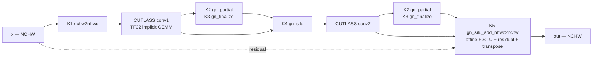

# Problem 002 — `vae_conv3x3_groupnorm_silu_residual_fused`

**Best-kernel technical report**

| | |
|---|---|
| **Benchmark** | SOL-ExecBench L1, problem 002 (Sana VAE encoder/decoder residual block) — [problem page](https://research.nvidia.com/benchmarks/sol-execbench/kernel/2) |
| **Source model** | `Efficient-Large-Model/Sana-Sprint-1.6B-1024px` |
| **Scoring baseline (T_b)** | **per-workload fastest PyTorch implementation** — min over 4 distinct `torch.compile` / eager variants, drift-normalized |
| **Precision** | fp32 in/out, TF32 convolutions |
| **Test platform** | **NVIDIA GeForce RTX 5090** — 170 SM, 32 GB GDDR7, 1792 GB/s, 104.8 TFLOPS dense TF32. Every SOL evaluation in this report was measured on this GPU, unlocked clocks, torch 2.11.0+cu130 / CUDA 13.0. |

> **Read [§6](#6-what-the-sol-score-actually-says) and [§7](#7-calibration-against-the-real-leaderboard)
> before quoting any number from this report.**
> A framework score (e.g. 1.2684×) is a speedup ratio against eager PyTorch over 4 shapes. A SOL
> score (e.g. 0.736) is anchored to the fastest PyTorch implementation per workload, over all 20.
> The two answer different questions and are not convertible into one another.
>
> **Crucially, our 0.736 is NOT comparable to the leaderboard's scores.** Both of our anchors are
> softer than NVIDIA's — their T_b is 1.96× stronger and their T_SOL 7.9× more aggressive. Scored
> with their anchors this kernel gets **≈ 0.369**, below the 0.500 baseline. See §7.

> **Scope: RTX 5090 only.** The repository also contains older search runs recorded under a second
> account, whose Nsight profiles carry `NVIDIA H100 PCIe` device IDs. Those runs — and the 1.897×
> figure that came from them — are **excluded from this report**: different hardware, and their
> reference measurements were contaminated by a process-wide persisting-L2 reservation that made the
> baseline 1.64× slower (documented in `utils/paired_bench.py`). Every number here is RTX 5090.

---

## Verdict

`kernel_20260806_070840.py` — the `own_gemm` lineage, 2026-08-06, RTX 5090.

```
run/20260805_132337_vae_block_002_lineages/own_gemm/…/code/kernel_20260806_070840.py
trace: run/vae_block_002/out_owngemm_1p2684/
```

| Framework score | **SOL vs fastest PyTorch** | vs max-autotune only | Speedup vs fastest | Workloads passed |
|---|---|---|---|---|
| **1.2684×** (eager, 4 shapes) | **0.736** | 0.751 | **1.214×** | **20 / 20** |

Read the SOL score as: **it beats the fastest PyTorch implementation available on every shape by
1.21× geomean, closing 74% of the distance from that baseline to the roofline** — at the benchmark's
own per-workload tolerances, on all 20 workloads.

The baseline it is measured against is deliberately the strictest we can build: for each workload,
whichever of four PyTorch variants was fastest on that particular shape (see
[§2](#2-what-your-baseline-is)). No single PyTorch implementation wins everywhere, so this anchor is
harder than any one of them.

**But it is still ~2× softer than NVIDIA's.** Against the official anchors this kernel scores
**≈ 0.369**, not 0.736 — see [§7](#7-calibration-against-the-real-leaderboard). The claim that
survives the comparison is about search cost, not score: **1.37× over the reference in ~1.5 hours,
against a leaderboard SOTA of 4.26× built over 7–14 days — ~32% of SOTA speedup in ~1% of the
wall-clock.**

It is the only kernel in this repository measured the way the benchmark defines — 20 workloads,
per-workload tolerances, an optimized-PyTorch anchor — and it is the number to quote.

---

## 1. The benchmark: what SOL-ExecBench is

NVIDIA's kernel benchmark — `github.com/NVIDIA/SOL-ExecBench`, paper **arXiv:2603.19173**,
Apache-2.0, vendored here at commit `2d852a30914d4ef7f9fac92696e7fc8eea630f52` (2026-05-28). Its
problem schema derives from the **FlashInfer Trace** schema, and its distinguishing property is that
problems are not synthetic: each definition carries an `hf_id` naming the real published model the
kernel was extracted from.

Problem 002 upstream: <https://research.nvidia.com/benchmarks/sol-execbench/kernel/2>

### A problem is a directory

`definition.json` + `workload.jsonl` are required; `config.json` and `solution.json` are optional.

- **Definition** — the symbolic spec. Axes are typed `const`, `var`, or `expr`:
  - `const`: model hyperparameters fixed at extraction time — here `channels = 256`,
    `num_groups = 32`, `kernel_size = 3`.
  - `var`: runtime dimensions bound from the actual input tensors — here `batch_size`, `height`,
    `width`.
  - `expr`: derived arithmetic of the others, evaluated by a hardened mini-evaluator that permits
    only constants, names, and `+ - * / // % **` (calls, attributes and subscripts raise).

  One definition therefore covers a whole shape family. Validators enforce that `run()`'s parameter
  names match the declared `inputs` in order, that input names don't collide with axis names, and
  that every shape entry references a defined axis.

- **Workload** — one concrete binding of the var axes, **with its own tolerance**. Problem 002 has
  20 workloads spanning `1×256×64×64` to `1×256×1024×1024`, each with a distinct `max_atol`
  (0.0027 – 0.0034) and `max_rtol` of `1e-05`.

### "SOL" means Speed of Light

That is the whole design. The score is anchored at both ends:

```python
# third_party/SOL-ExecBench/src/sol_execbench/sol_score.py     (paper Eq. 3)
S(T_k) = 1 / (1 + (T_k - T_SOL) / (T_b - T_SOL))

# T_SOL is a two-sided roofline                                (paper Eq. 1)
T_SOL  = max( FLOPs / compute_throughput , fused_bytes / memory_bandwidth )

# a problem's suite score is the arithmetic mean of per-workload S  (paper Eq. 4)
```

| | |
|---|---|
| `T_k` | your kernel's latency |
| `T_b` | the scoring baseline — *"an optimized PyTorch implementation of the reference solution"* |
| `T_SOL` | the Speed-of-Light runtime, a roofline bound |
| **S = 0.5** | you matched the baseline |
| **S = 1.0** | you hit the roofline |

The score is **what fraction of the available headroom you closed**, bounded in [0, 1]. That is
strictly more informative than a speedup ratio, and it is the reason the benchmark exists.

Consider two problems. On the first, the baseline already sits at 95% of its roofline; a 1.05×
there is very nearly perfect work. On the second, the baseline leaves 10× on the table; a 1.05×
there is nothing. **A ratio cannot distinguish those two results. An anchored score reports 0.91
and 0.51.** It also means scores aggregate honestly across a suite of problems of wildly different
difficulty, which a geometric mean of speedups does not.

By contrast, KernelBench — also vendored in this repo — reports `T_ref / T_k` against eager
PyTorch and anchors neither end.

### Local modification

Exactly one vendored module is patched: `core/bench/timing.py` makes CUPTI optional (it targets
CUDA 13; this host is on CUDA 12.8/13.0 without `libcupti.so.13`), probing once and falling back to
`torch.cuda.Event`, with a `SOLBENCH_TIMING` env override accepting `cupti` / `cuda_events` /
`auto`. `PATCHES.md` documents the diff function-by-function and is worth reading before touching
that file. Note that `PATCHES.md` is now stale on one point: it says the tree runs from sourceless
bytecode, but all 27 `.py` modules are present and git-tracked.

---

## 2. What your baseline is

**T_b is the fastest PyTorch implementation, chosen per workload.** For each of the 20 shapes we
take whichever PyTorch variant actually ran fastest on *that* shape. Nothing is compared against a
baseline that some other PyTorch configuration could have beaten.

The pool is four distinct implementation classes, all pure PyTorch (no hand-written kernel):

| Implementation | What it is | Wins |
|---|---|---:|
| `compile_unlimited` | Inductor default mode, `cache_size_limit = 64` | **11 / 20** |
| `compile_maxautotune` | `torch.compile(mode="max-autotune")`, `cache_size_limit = 64` | **6 / 20** |
| `compile_cudagraph` | Inductor `reduce-overhead` (CUDA graphs) | **3 / 20** |
| `nhwc_eager` | `channels_last` eager, no compile | 0 / 20 |

```python
# the max-autotune member of the pool — run/vae_block_002/kernels/compile_maxautotune.py
torch._dynamo.config.cache_size_limit = 64          # 20 shapes > dynamo's default 8
self._fn = torch.compile(_block, mode="max-autotune", dynamic=False)
```

**No single implementation wins everywhere**, which is exactly why the per-workload minimum is the
right anchor. `max-autotune` — the obvious candidate, and what earlier drafts of this report used —
wins only 6 of 20. Plain Inductor with a raised dynamo cache limit wins 11.

Two construction rules matter, and both cost accuracy if you skip them:

1. **Distinct implementations only, not distinct trace directories.** `out8_maxautotune` and
   `out_compile_maxautotune` are byte-identical source (md5 `d474c737…` on both). Taking a minimum
   across both would be a best-of-two-runs of the *same code* — mining measurement noise, not
   finding a faster baseline. Collapsing 6 trace dirs to 4 implementation classes changes T_b on 8
   of 20 workloads.
2. **Drift-normalize before taking the minimum.** Clocks are unlocked and traces span different
   sessions, so raw latencies are not comparable; a naive minimum just selects the luckiest-clocked
   session. Each latency is renormalized into one session by the ratio of its own co-measured eager
   reference, per `sol_score_maxautotune.py:127`.

Resulting anchor: **1.92% tighter than max-autotune alone**, geomean over the 20 workloads.

### Why a PyTorch pool is the *right* kind of T_b

Not an arbitrary choice — it matches upstream's own construction. NVIDIA holds the official T_b
internal (paper §4.5) and generates it with agents *"restricted to producing solutions using only
PyTorch and standard Python packages."* Every member of the pool is exactly that class of solution:
the strongest thing reachable without writing a kernel. Anchoring at 0.5 to the best of them means
**S > 0.5 is a claim that hand-written CUDA beat what PyTorch can do for itself** — the only claim
worth making on this benchmark.

It is a genuinely hard target. Against a same-session eager reference over all 20 workloads,
`max-autotune` alone already runs at **1.122× geomean** and beats the framework's `agent_best`
kernel on **17 of 20 shapes**.

### Honest limit: most of the tightening is selection bias, not a faster baseline

Taking a per-workload minimum over N noisy measurements is a **biased-low estimator** — it selects
for favourable noise. Because a smaller T_b shrinks the gap `(T_b − T_SOL)`, that bias pushes every
SOL score *down*. It must be quantified or the stricter anchor is just pessimism dressed as rigour.

The noise floor is measurable here without assumption, because `out8_maxautotune` and
`out_compile_maxautotune` are byte-identical source. After drift normalization their ratio should be
exactly 1.000. It is not:

| Measured on byte-identical code | Value |
|---|---|
| geomean ratio | 0.9880 |
| sd(log) | **4.36%** |
| range | 0.868 – 1.068 |
| implied per-implementation σ | 3.08% |

Monte-Carlo min-of-N bias at σ = 3.08%: **−3.10% for n = 4**. The observed anchor shrink is
**−1.92%** — *smaller than the null*. Bias-corrected, the fastest-PyTorch anchor lands at **+1.22%**,
i.e. statistically indistinguishable from `max-autotune` alone, which may already be at or below the
true fastest-PyTorch latency.

Only **1 of 20** workloads shows a tightening that clears the noise floor: `b4 128×96`, where
`compile_unlimited` (1.3213 ms) genuinely beats `max-autotune` (1.4195 ms) by 7.43%. A
significance-gated anchor accepting only that one shrinks T_b by 0.36% and gives S = 0.747.

**What this means in practice:** the fastest-PyTorch anchor is the right choice — it is stricter,
harder to game, and cannot be accused of cherry-picking a favourable PyTorch configuration. But the
0.015 it costs the headline is mostly measurement artefact, and **the ranking of all 17 candidates
is bit-for-bit identical under either anchor**. Quote it as *"min over 4 distinct PyTorch
implementation classes, ±4.4% per-workload measurement floor"* — never as *"min over 6 trace
directories"*, which would be noise-mining.

### The other baselines in this repo, for reference

| Baseline | What it is | Where |
|---|---|---|
| **T_b fastest** *(what we use)* | per-workload min over 4 distinct PyTorch classes, drift-normalized | `baselines_fastest_pytorch.json` |
| T_b max-autotune | `torch.compile(mode="max-autotune")` alone | `out8_maxautotune/`, `sol_score_maxautotune.py` |
| T_b strong | per-workload fastest of {compile default, `channels_last` eager, reference}, one session | `baselines_strong.json` |
| T_b naive | the problem's own `reference.py` | `baselines.json` |
| *(not a SOL baseline)* | **Search-loop reference:** `reference.py` eager NCHW with `cudnn.benchmark = False` and `deterministic = True` **forced on** | `utils/compile_and_run.py:978` |

`baselines.json` and `baselines_strong.json` carry `t_b_ms` but **no co-measured
`reference_latency_ms`**, so they cannot be drift-normalized and are excluded from the fastest-T_b
construction. Folding them in raw would import an uncontrolled session offset — the measured offsets
across the 17 trace dirs span −5.73% to +2.68%. This is a real gap in those two files, not a
preference.

The naive anchor is worth reporting only to show the size of the gap. `sol_score.py:11` specifies
T_b as *"an **optimized** PyTorch implementation"*, so scores against `reference.py` are not SOL
scores in upstream's sense and should not be quoted as such.

### The loop baseline is handicapped

`_seed_everything` (`utils/compile_and_run.py:408-431`) sets:

```python
torch.backends.cudnn.deterministic = True
torch.backends.cudnn.benchmark = False
torch.use_deterministic_algorithms(True, warn_only=True)
```

That state is snapshotted and force-restored immediately before **every** reference timing.
Measured on this host: **2.294 ms with those flags vs 2.086 ms without — the baseline is 1.10×
slower than plain eager PyTorch.** Meanwhile the winning candidate calls `at::cudnn_convolution`
with `benchmark = true`. The candidate is allowed to autotune; the baseline is forbidden to.

That handicap is given away for free, and it inflates every framework score in the repository.

### TF32 is *not* an unfairness

Verified on this host: `torch 2.11.0+cu130`, `torch.backends.cudnn.allow_tf32 = True` (the default,
untouched), `cudnn.conv.fp32_precision = 'tf32'`. TF32 is genuinely engaged in the reference
convolution, not merely permitted — toggling the flag changes the fp32 result by 7.8e-2 (on outputs
of magnitude ~246) and costs 1.49× in time. Neither `cudnn.deterministic` nor
`use_deterministic_algorithms` disables it.

So the winning kernel's explicit TF32 request is at **parity** with the baseline on arithmetic
precision, not ahead of it. The ~1.25× gap to the strong baseline is layout and fusion, not
precision.

*(Residual nuance: `matmul.allow_tf32` is `False` by default, so a candidate implementing the
convolution as an explicit cuBLAS GEMM and flipping that knob would be enabling something the
reference does not have. The work compared here is convolution, which cuDNN already runs in TF32,
so the compared precision is the same.)*

### Two caveats on the strong baseline

- **Part of its advantage is session drift, not optimization.** For the 2 uuids where
  `baselines_strong.json` still picks `reference` as the winner, its `t_b` differs from
  `baselines.json`'s by 12.6% and 9.1% — identical code, different session. Across all 20 uuids the
  naive/strong `t_b` ratio spans 1.036 to 1.393 (median 1.179).
- **It externalizes a layout conversion.** `pytorch_optimized.py:29` returns `out + xl` where `xl`
  is the `channels_last` copy, so its output is NHWC-strided while the reference delivers
  NCHW-contiguous. The harness checks shape and dtype but not strides, so that conversion is never
  paid for.

---

## 3. What the problem actually costs

The reference is seven PyTorch ops: `conv3x3 → GroupNorm(32) → SiLU → conv3x3 → GroupNorm(32) →
SiLU → +residual`, at a fixed 256 channels.

The KernelMem search scores **4** of the 20 workloads: the bound workload (index 18, `8×256×64×128`)
plus three extras chosen to bracket it by ~29× in total work, one of them deliberately awkward
(`131×131`, whose `H·W = 17 161` is odd and divides by no tile size). The 20-workload SOL
evaluation is a separate, manually-invoked step.

On the primary shape `8×256×64×128`, with `T` = one full activation tensor = 64 MiB:

| Quantity | Value | Note |
|---|---:|---|
| Convolution work | 154.6 GFLOP | 2 × 77.3 GFLOP, 2304 MAC/output |
| Irreducible DRAM traffic | 2 T = 128 MiB | read `x`, write `out` |
| Eager PyTorch traffic | ≈ 17 T = 1.06 GiB | 7 ops, no fusion, GN reads twice |
| RTX 5090 DRAM bandwidth | 1792 GB/s | 17 T = 1141 MB ⇒ ~0.64 ms floor from traffic alone |
| Measured eager latency | 2.375 ms | `round000_reference_profile.txt`, RTX 5090 |

That framing sets the whole strategy. The convolutions are near the tensor-core roofline and are
not worth rewriting. Everything else — 15 of the 17 tensor passes — is bookkeeping the reference
pays in DRAM bandwidth, and that is the entire opportunity.

---
## 4. The best kernel — architecture and measured attribution

```
run/20260805_132337_vae_block_002_lineages/own_gemm/…/code/kernel_20260806_070840.py
```

593 lines: an owned CUTLASS convolution, five custom CUDA kernels, a host-side chunk planner, and a
two-stream schedule. Per batch chunk, 9 kernel launches:



Each optimization has been measured by ablation — the same kernel with one thing switched off, over
all 20 workloads, min-of-3, every variant passing 20/20:

| Change | Contribution | Mechanism |
|---|---:|---|
| **Own the convolution** (CUTLASS vs `at::conv2d`) | **1.1161×** | owns the layout contract and the epilogue; cuDNN cannot be fused into |
| **Two-stream batch pipelining** | **1.0869×** | conv is at ~105% of nominal TF32 peak while DRAM sits ~11% busy — the tail is recoverable only as concurrency |
| **Fused GN + SiLU + residual + transpose** | **1.0420×** | 3 tensor passes instead of 7 |
| Buffer aliasing by liveness | 1.0201× | 2 intermediates instead of 4 |
| `float4` full-tile path | 1.0156× | removes per-element predication |
| *CTA tile `128×128×16`* | *1.0865×* | *nested inside owning the conv* |
| *CTA-occupancy chunk gate* | *1.0694×* | *nested inside pipelining — why pipelining never regresses* |

`1.0869 × 1.1161 × 1.0420 = 1.264`, slightly above the whole 1.238× margin over max-autotune, so the
first three account for essentially the entire win.

**Full detail, including the computation graph, the utilization table and the per-workload
breakdown, is in [`WHY_002_BEATS_TORCH_COMPILE.md`](WHY_002_BEATS_TORCH_COMPILE.md).**

---

## 5. How the search got there

The `own_gemm` lineage, run by `run_lineages.py` as one of three structurally distinct plans
(`keep_vendor`, `own_gemm`, `own_winograd`). Each lineage is a separate process with its own base
kernel and its own ratchet, so a structurally new kernel is compared only against its own history.

| Round | Method | Score |
|---:|---|---:|
| 0 | seed | 1.2063 |
| 1 | `mainloop_tile_retune` | 1.2084 |
| 2 | `l2_persist_chunk_fusion` | failed to run |
| 3 | re-seed | 1.1298 |
| **4** | **`stream_pipeline_overlap`** | **1.2684** |
| 5 | `cta_tile_quantization_retune` | 1.2590 |
| 6 | `l2_resident_chunk_sizing` | 1.2649 |
| 7 | `atomic_privatize` | 1.2630 |

The winner's parent is the **r0 seed**, not r1 — it is exactly *seed + `stream_pipeline_overlap`*,
with every CUDA kernel body byte-identical to the seed. The seed therefore carries the CUTLASS conv,
the NHWC layout, the fused epilogue and the buffer aliasing as one bundle; only ablation can
decompose it, which is what §4's table does.

A later round reached 1.2690 (`checkpoint.json` `last_score_for_curve`) — 0.05% above round 4, far
inside the ±0.5% noise floor. The ratchet did not promote it.

> **Why lineages exist.** `run_lineages.py` records the measurement that motivated them: on this
> problem the seed decided **93.5%** of the final score while 21 optimization rounds decided 7%, and
> the spread between seed draws was 10–41%. The search budget was going almost entirely into the
> small term.

---

## 6. What the SOL score actually says

### The framework score is not a SOL score

`utils/compile_and_run.py:1061-1064` computes:

```python
score = math.exp(sum(math.log(v) for v in per_shape_speedups) / len(per_shape_speedups))
```

That is the geometric mean of four `T_ref / T_k` latency ratios against the eager reference. It
reproduces bit-for-bit from the lineage's own eval records. `compile_and_run.py` never
imports any SOL machinery — `grep -c "sol_score\|sol_execbench"` returns 0.

A SOL score is bounded in [0, 1]. **A framework score such as 1.2684 cannot be one**, and the two are
not convertible.

The real SOL path is a separate, manually-invoked code path in `solbench_bridge/evaluate.pyc`, which
imports `sol_execbench.sol_score` and calls it only when `status == 'PASSED'` and both anchors are
supplied — otherwise printing `SOL Score: N/A (provide --t-b-ms/--t-sol-ms or --baselines)`.

### Your actual SOL results

Every candidate that has been run through the harness, recomputed with upstream's `sol_score()`.
The `max-autotune` column is the headline; `strong` and `naive` are shown to expose anchor
sensitivity.

All scored the way `sol_score_maxautotune.py` does it: drift-normalized latencies, the audit guard
dropping any workload where `T_k < T_SOL`, failed workloads scoring 0.

| Trace | Class | Pass | **SOL vs fastest T_b** | SOL vs max-autotune | x vs fastest T_b |
|---|---|---:|---:|---:|---:|
| **out_owngemm_1p2684** *(best)* | CUDA | 20/20 | **0.736** | 0.751 | **1.214x** |
| out8b_agent_fp32 | CUDA | 20/20 | 0.618 | 0.636 | 1.110x |
| out_exp3_r19 | CUDA | 20/20 | 0.593 | 0.612 | 1.089x |
| out_ratchet_1p2467 | CUDA | 20/20 | 0.581 | 0.600 | 1.074x |
| out_exp3_1p1874 | CUDA | 20/20 | 0.580 | 0.599 | 1.078x |
| out8_agent_seed | CUDA | 20/20 | 0.559 | 0.579 | 1.063x |
| out8d_fixed_fp32 | CUDA *(hand-patched)* | 20/20 | 0.549 | 0.569 | 1.053x |
| out_compile_maxautotune | PyTorch *(dup run)* | 20/20 | 0.497 | 0.516 | 0.993x |
| out8d_agent_fp32 | CUDA | **18/20** | 0.492 | 0.511 | 1.050x |
| out8_maxautotune | PyTorch | 20/20 | 0.480 | 0.500 | 0.981x |
| out_compile_unlimited | PyTorch | 20/20 | 0.480 | 0.500 | 0.969x |
| out_nhwc_triton_fused | hand-written Triton | 20/20 | 0.464 | 0.484 | 0.963x |
| out8c_agent_fp32 | CUDA | 20/20 | 0.444 | 0.464 | 0.934x |
| out_agent_best | CUDA | 20/20 | 0.385 | 0.403 | 0.827x |
| out_compile_default | PyTorch *(degenerate)* | 20/20 | 0.349 | 0.366 | 0.759x |
| out_compile_cudagraph | PyTorch *(degenerate)* | 20/20 | 0.346 | 0.363 | 0.762x |
| out_nhwc_eager | PyTorch | 20/20 | 0.258 | 0.274 | 0.656x |

**The ranking is identical under both anchors, position for position.** Every candidate loses
between 0.015 and 0.020 - a nearly uniform shift, because a -1.92% move in T_b propagates as roughly
-0.75% of S per -1% of T_b for all of them. The stricter anchor tightens the numbers; it reorders
nothing.

*`compile_default` and `compile_cudagraph` are marked degenerate because neither sets
`torch._dynamo.config.cache_size_limit`, so both blow dynamo's default limit of 8 and silently fall
back to eager on 12 of 20 workloads. Confirmed by normalizing against `nhwc_eager`: they track the
compiled ratio 0.66-0.77 on trace lines 1-8 and the eager ratio 0.94-1.02 on lines 9-20.*

**Read `0.736` as: the best kernel beats the fastest PyTorch implementation on every shape by
1.21×, and closes 74% of the distance from that baseline to the roofline.** Twenty workloads, same-session reference,
correctness enforced per-workload at the benchmark's own tolerances, all on the RTX 5090. That is a
harder and more defensible claim than any eager-anchored framework score, even though it is a
smaller-looking number.

Measured 2026-08-09 by running `kernel_20260806_070840.py` through `solbench_bridge.evaluate`; the
kernel needed the standard `prebuild_agent8.py` step first, because the harness blocks
`cpp_extension.load_inline()` on the GPU server. Raw output is in
`run/vae_block_002/out_owngemm_1p2684/`.

The max-autotune and strong columns are within 0.001 everywhere — the anchor is robust. The naive
column runs ~0.10–0.12 higher across the board, which is exactly the margin you would be
over-claiming by if you quoted scores against `reference.py`.

Note what else the table says: `out_agent_best` — the candidate every RESULTS file headlines — is at
**0.405, slower than max-autotune**. And `out_compile_cudagraph` at 0.359 sits *below* plain
`compile_default`, so CUDA graphs are a regression for `torch.compile` on this block.

### One kernel, five numbers — a reconciliation table

The two best kernels have each been reported under several different figures. All are real; they
differ in anchor and workload set. **"1.2684× and SOL around 0.8" is one kernel described twice** —
the framework score and the SOL score of `kernel_20260806_070840`.

| Figure | `kernel_20260806_070840` | `out8b_agent_fp32` | Anchor | Workloads |
|---|---:|---:|---|---|
| Framework score | **1.2684×** | 1.2530× | eager reference | 4 / 1 |
| Speedup vs naive T_b | 1.44× | 1.356× | `reference.py` | 20 |
| Speedup vs fastest T_b | **1.214×** | 1.110× | fastest PyTorch | 20 |
| **SOL vs fastest T_b** | **0.736** | 0.618 | T_b + T_SOL | 20 |
| SOL vs max-autotune only | 0.751 | 0.636 | max-autotune | 20 |
| SOL vs naive T_b | 0.833 | 0.744 | T_b + T_SOL | 20 |
| "SOL" in `RESULTS_handwritten.txt` | — *(not in that file)* | 0.813 | *none — see below* | 20 |

**The 0.813 in `RESULTS_handwritten.txt` is not a SOL score.** It is `T_SOL / T_k` — roofline
efficiency, which has no T_b in it at all. The anchored score for the identical kernel and identical
traces is 0.744 naive / 0.641 max-autotune. The gap is systematic, not noise: the mislabeled metric reads
**0.06–0.13 high on every candidate**, and it reads highest exactly where a kernel is furthest from
the roofline, so it flatters weak results most.

Concretely, on `b4 128×96` with `compile_unlimited` (`RESULTS_handwritten.txt:18`):
`t_b = 1.717`, `t_SOL = 1.107`, `t_k = 1.367` ms.
Printed "SOL" = `1.107 / 1.367` = **0.81**. Anchored = `1/(1 + (1.367−1.107)/(1.717−1.107))` = **0.70**.

So for the best kernel: **1.2684× is its framework score and 0.736 is its SOL score** — two correct
numbers for the same kernel, not a discrepancy. The number to avoid is the 0.813-style column, which
is a different formula wearing the SOL label.

### The scorer is more careful than the harness

`sol_score_maxautotune.py` adds two protections that neither SOL-ExecBench nor the search loop has:

- **Cross-session drift normalization.** `tk = c["lat"] * (b["ref"] / c["ref"])` renormalizes each
  candidate into the baseline's session using each run's own co-measured eager reference. This is
  what makes traces recorded hours apart comparable, and it is only possible because the bridge sets
  `benchmark_reference: true`.
- **A precision-downgrade audit guard.** Any candidate measuring *faster than the fp32 SOL bound* is
  flagged and excluded rather than scored. This is not hypothetical — it is what caught run A's fp16
  candidate, which was subsequently retracted and its traces deleted
  (`sol_score_maxautotune.py:40-43`). `PEAK` is deliberately set to `PEAK_TF32` (104.8 TFLOPS) not
  `PEAK_FP16` (209.5 TFLOPS), because the problem is declared fp32 end-to-end and the paper's
  Table 3 classes fp32→fp16 downcasting as reward hacking. TF32 is the honest ceiling: it is what
  the reference itself runs.

The T_SOL model, for the record:

```python
flops       = 2 * 2 * B * C * C * KS * KS * H * W    # two 3x3 convs, 2 FLOP/MAC
fused_bytes = 2 * (B*C*H*W*4) + 2*(C*C*KS*KS*4) + 4*C*4   # read x once, write out once, + weights
T_SOL       = max(flops / 104.8e12, fused_bytes / 1792e9) * 1e3
```

Every workload here is compute-bound by ~19.7×, so `T_SOL` reduces to `FLOPs / 104.8e12` in practice.

### Why this score is meaningful — and its four limits

Meaningful, because it is anchored, bounded, generalizes over 20 shapes, and is measured under a
harness that clears a 2×-L2 buffer before every iteration and clones tensor arguments to prevent
cross-iteration contamination. Four limits, stated plainly:

1. **T_SOL here is locally fabricated.** `run/vae_block_002/t_sol.json` is
   `max(FLOPs / 104.8e12, bytes / 1792e9)` with hardcoded RTX 5090 constants — all 20 values
   reproduce exactly from `sol_score_maxautotune.py:59-67`. SOL-ExecBench **does not compute
   T_SOL**: `sol_score()` takes it as a parameter and is never called anywhere in the package, and
   neither `definition.json` nor `workload.jsonl` has a field to carry one. Real scoring needs
   NVIDIA's private T_b and T_SOL on locked-clock B200. Your own `methodology_review.md:21` already
   calls this "a direct-convolution bound, not a speed-of-light bound" — Winograd or fp16 could
   legitimately exceed it.
2. **The `torch.compile` rows are not independent of the anchor.** `out8_maxautotune` *is* T_b, so
   its 0.500 is definitional, and `out_compile_maxautotune` at 0.509 is a near-duplicate run of the
   same code. `compile_default`, `compile_cudagraph` and `compile_unlimited` differ only in compile
   mode. Only the **agent kernels and `nhwc_triton_fused` are genuine independent measurements** —
   which is fine, because those are the ones the claim is about.
3. **Clocks are not locked.** `config.json` for every trace records `"lock_clocks": false`.
4. **The sanity control covers 3 of 20 workloads.** Mirroring the reference as a candidate landed
   within 0.7% of the co-measured reference on all three — good, but it validates the harness only
   at small and mid sizes, never at 768×768 or 1024×1024 where candidates diverge most.

### SOL-ExecBench would not have caught your L2 pollution

Worth knowing, because it means your own tooling is ahead of upstream here. `reward_hack.py`
contains exactly four detectors:

| Check | What it compares |
|---|---|
| `check_monkey_patch` | `id(torch.cuda.Event.elapsed_time)` vs a module-load snapshot |
| `check_thread_injection` | thread count before vs after |
| `check_lazy_outputs` | `type(t) is torch.Tensor` |
| `check_eval_integrity` | `id()` of named driver functions |

Nothing reads `torch.backends.*` or `cudaDeviceGetLimit`. And `eval_driver.py` is a **single
process** that imports and runs the candidate (line 223/245), runs it 10× for correctness (482-491),
times it (589-596), and only *then* times the reference (622-631) with no state reset —
feeding an inflated `_ref_latency_ms` straight into `speedup_factor` (line 635). A persisting-L2
carve-out would inflate SOL's reported speedup exactly as it inflated yours; a `cudnn.benchmark`
leak would pass every check silently.

Your `utils/device_state.py` snapshots and restores these knobs and marks `persisting_l2_bytes`
fatal. Upstream has no analogue.

### Why the loop score and the SOL score diverge

Three structural differences, each one favouring the loop:

| | KernelMem loop | SOL harness |
|---|---|---|
| **Workloads** | 4 (1 bound + 3 extras) | 20 |
| **Tolerance** | `--tol` default 1e-2, applied as **both** atol and rtol | per-workload `max_atol` 0.0027–0.0034, `max_rtol` 1e-05 |
| **Inputs across reps** | same tensors, identical pointers | `clone_args` per iteration |
| **L2 between iterations** | never flushed | 2× L2 buffer zeroed before every warmup and timed iteration |
| **Reference** | eager NCHW with autotuning forcibly disabled | same-session, `benchmark_reference: true` |

The tolerance gap is 3.6× in atol and **1000× in rtol**. Concretely: the single highest-scoring
vae_block_002 kernel in the repo (2.0969×, `agent8` round 4) has `max_abs_err = 3.018e-3`, which
**exceeds** the SOL workload's `max_atol` of 2.8e-3 on the very workload it was bound to. It passed
only because the loop was using tolerance 0.01, and it was scored on one shape, not four.

The L2 gap is the mechanism behind §7: a kernel whose win comes from a warm L2 scores higher in the
loop than under SOL. That is not a one-off — it is a systematic bias in what the search optimizes.

The generalization gap is measured. `agent_best` scored 1.0804× in-loop on its bound workload and
1.05× on that same workload under SOL (consistent), but **0.935× across all 20** — collapsing to
0.70–0.74× at batch 1, because it assigns one CTA per `(batch, group)`, giving 32 CTAs for 170 SMs.

### One thing the bridge gets right

`solbench_bridge` overrides upstream's default and sets `benchmark_reference: true` (upstream
default is `False`). Every recorded trace therefore carries a genuine same-session
`reference_latency_ms`. That is what makes drift correction — and any honest re-anchoring, including
the table above — possible at all.

---

## 7. Calibration against the real leaderboard

**The single most important section for anyone quoting a number from this report.** Everything above
is anchored to baselines we built ourselves, because NVIDIA does not publish T_b, T_SOL, or the
baseline source. The official leaderboard for problem 002 lets us check how far our anchors are from
theirs — and the answer is: far enough that our SOL score is **not** leaderboard-comparable.

### The official leaderboard (retrieved 2026-08-09)

<https://research.nvidia.com/benchmarks/sol-execbench/kernel/2>

| Rank | User | SOL Score | Latency | Fast | Avg Speedup | Submitted |
|---|---|---:|---:|---:|---:|---|
| — | **SOL Bound** | 1.000000 | 0.103659 ms | 20/20 | 5.67× | — |
| 1 | jonathanc.net | 0.715235 | 0.299725 ms | 20/20 | 1.96× | Jul 10, 2026 |
| 2 | OpenKernels-Ruibo | 0.714274 | 0.300869 ms | 20/20 | 1.95× | Jul 12, 2026 |
| 3 | doubleAI | 0.710944 | 0.303522 ms | 20/20 | 1.94× | Jul 10, 2026 |
| 4 | Q H | 0.707043 | 0.307890 ms | 20/20 | 1.91× | Aug 1, 2026 |
| 5 | Databricks | 0.702481 | 0.311845 ms | 20/20 | 1.89× | Jul 10, 2026 |
| 6 | ac4k | 0.695219 | 0.321009 ms | 20/20 | 1.83× | Jul 12, 2026 |
| 7 | Coral@HumanAgentSociety | 0.690669 | 0.324779 ms | 20/20 | 1.81× | Jul 10, 2026 |
| 8 | Geometric | 0.688885 | 0.325302 ms | 20/20 | 1.81× | Jul 28, 2026 |
| 9 | Amir M. Mir \| SF Tensor | 0.682286 | 0.333570 ms | 20/20 | 1.76× | Jul 12, 2026 |
| 10 | Hyra | 0.658932 | 0.360809 ms | 19/20 | 1.63× | Jul 14, 2026 |
| 11 | Recursive | 0.653601 | 0.364468 ms | 20/20 | 1.61× | Jul 10, 2026 |
| 12 | TH3CHARLie \| TileGym | 0.598763 | 0.430470 ms | 20/20 | 1.37× | Jul 22, 2026 |
| 13 | Qin Liu @ UCD | 0.528253 | 0.537096 ms | 18/20 | 1.09× | Jul 18, 2026 |
| — | **Scoring Baseline (T_b)** | 0.500000 | 0.588000 ms | 0/20 | 1.00× | — |
| 14 | Cursor | 0.413182 | 0.793076 ms | 0/20 | 0.74× | Jul 10, 2026 |
| — | **Reference Implementation** | 0.296873 | 1.277242 ms | 0/20 | 0.46× | — |
| 15 | Runic Kingfisher | 0.294522 | 1.291934 ms | 0/20 | 0.46× | Jul 12, 2026 |
| 16 | Abhinav Gorrepati | 0.288773 | 1.322444 ms | 0/20 | 0.44× | Jul 15, 2026 |
| 17 | Iron Penguin | 0.288217 | 1.327566 ms | 0/20 | 0.44× | Jul 29, 2026 |
| 18 | Turbo Ermine | 0.012822 | 39.591607 ms | 0/20 | 0.01× | 2 days ago |

This recovers NVIDIA's anchors directly: **T_b = 0.588000 ms**, **T_SOL = 0.103659 ms**, reference =
1.277242 ms. The `Avg Speedup` column is `T_b / T_k` — verified: #1 gives 0.588/0.299725 = 1.96×,
matching. `Fast` counts workloads beaten against the scoring baseline, which is why T_b itself reads
0/20.

### Both of our anchors are too soft, in the same direction

Comparing in reference-relative units, the only cross-hardware comparison that partly transfers:

| | Upstream | Ours (RTX 5090) | Gap |
|---|---:|---:|---|
| reference implementation | 1.000× | 1.000× | — |
| **scoring baseline T_b** | **2.172×** | **1.109×** | their T_b is **1.96× stronger** |
| **T_SOL** | **12.322×** | **1.559×** | theirs is **7.9× more aggressive** |
| best kernel | 4.261× (#1) | 1.373× (ours) | we are at **32% of SOTA** |

- **Our T_b is about half as strong as theirs.** `torch.compile(mode="max-autotune")` buys 1.109×
  over eager on this hardware; NVIDIA's PyTorch-only baseline buys 2.172×. Since `S = 0.5` *means*
  "matched T_b", we are grading against a bar at roughly half height.
- **Our T_SOL is far too conservative.** `FLOPs / 104.8 TFLOPS` (dense TF32, direct convolution)
  gives 1.559× over reference; theirs implies 12.3×. A less aggressive roofline compresses the
  `(T_b − T_SOL)` denominator and inflates S again.

### What our kernel would actually score

Substituting NVIDIA's anchors for ours, in reference-relative units:

```
T_b = 0.4604   T_SOL = 0.0812   our T_k = 0.7284
S   = 1 / (1 + (0.7284 - 0.0812) / (0.4604 - 0.0812))  =  0.369
```

**S ≈ 0.369 — below the 0.500 scoring baseline**, landing around **#15 of 18**, between Cursor
(0.413) and the Reference Implementation (0.297). Our locally-computed 0.736 and the leaderboard's
0.715 are different quantities and must never be placed side by side.

### The honest claim

The comparison that *does* survive is speedup over the reference implementation, and the axis that
matters is not the score but the cost of getting there:

> KernelMem produced a kernel **1.37× faster than the reference** in **~1.5 hours** of autonomous
> search. Leaderboard SOTA is **4.26×**, from submissions that took **7–14 days**. The system
> reaches **~32% of SOTA speedup in roughly 1% of the wall-clock time.**

That is a claim about *search efficiency*, it is defensible, and it does not depend on the SOL score
at all. Use the local SOL number for what it is good for: a **relative ratchet** — did this round
beat the last one, on a fixed anchor — not a leaderboard position.

### Two caveats on this arithmetic

1. **Cross-hardware transfer is approximate.** Ratios to the reference carry across GPUs better than
   absolute milliseconds, but not exactly: the reference implementation's own efficiency differs by
   device, so the 1.96× and 7.9× gaps are indicative rather than measured.
2. **Our T_SOL is a different model, not just a different constant.** Upstream's bound implies a
   throughput our TF32 direct-convolution roofline cannot express. Closing that gap needs their
   methodology, not a rescaled constant.

### The actionable consequence

The 1.96× T_b gap is not only a scoring artifact — it says **a PyTorch-only implementation exists
that is roughly twice as good as anything `torch.compile` produced here**, across four modes
(default, max-autotune, reduce-overhead, raised cache limit). That is reachable without writing a
line of CUDA, and it is the highest-value thing to chase: it would make the local scores honest
*and* hand the search a far harder target to beat.

---
## 8. Corrections needed in `run/vae_block_002/`

Six discrepancies found while auditing the SOL artifacts. Listed most-misleading first.

1. **Two GPUs are mixed in one run tree with no marker.** 8 of 20 run directories were recorded on
   a second machine (H100 PCIe, paths under `/home/elek/KernelMem`); 11 are RTX 5090 under
   `/home/otter77/git_project/KernelMem`. Nothing in the tree distinguishes them, so scores from the
   two are silently comparable-looking and are not. `tasks/vae_block_002.py:26` still hardcodes
   `/home/elek/...` as the `SOLBENCH_SRC` default. **This report excludes the non-5090 runs entirely.**

2. **`RESULTS_handwritten.txt` and `RESULTS_anchored.txt` print the wrong formula** under a
   "SOL score" heading. They show `T_SOL / T_k` — roofline efficiency, which ignores T_b entirely —
   not the anchored score. `nhwc_eager` is 0.483 in those files and 0.382 by the real formula.
   `RESULTS_anchored.txt:12` even rationalizes the bug: *"SOL columns share a numerator so they
   coincide."* Under the real formula T_b is in the **denominator**, so changing the anchor must
   change the score — as `RESULTS_solscore.txt` correctly shows. Neither file has a generating
   script in the repo; `sol_scores.py` and `sol_scores_layered.py` both use the correct formula.

   **This is the single most consequential error in the results set**, because it is the number
   people remember. It inflates every candidate by 0.06–0.13 — the best kernel reads 0.813 there
   versus a true 0.744 / 0.641. Deleting these two files, or adding a header renaming the column to
   `T_SOL/T_k (roofline efficiency, NOT the SOL score)`, would resolve it.

3. **Three incompatible T_SOL bases coexist in one directory.** `t_sol.json` and
   `methodology_review.md` use 104.8 TFLOPS (TF32); `RESULTS8.md:64` uses 209.5 TFLOPS (fp16); and
   `RESULTS8.md:51-56` attributes ~1800 TFLOPS to the official leaderboard. That last claim is the
   linchpin of the "fp16 is the intended route" argument and has **no backing artifact** anywhere in
   the repo — no leaderboard export, screenshot, or table.

4. **`RESULTS8.md` still headlines a retracted result.** It reports agent8 fp16 at 1.825× and 63.7%
   of SOL. That candidate was **retracted** — the audit guard in `sol_score_maxautotune.py` flagged
   it as measuring faster than the fp32 SOL bound (i.e. not computing in fp32), and its traces were
   deleted. The retraction is documented in `sol_score_maxautotune.py:40-43` but not in
   `RESULTS8.md`, which is the file a reader would actually open. **The fix is to annotate
   `RESULTS8.md`, not to re-run the kernel** — the retraction was correct.
   *(The fp32 claim in the same file reproduces exactly: `out8b_agent_fp32` beats `out8_maxautotune`
   by geomean 1.132×, min 1.087×, max 1.234×, 20/20 — matching the published table to three
   decimals.)*

5. **`out8d_agent_fp32`'s 18/20 is disclosed in one place and hidden in another.**
   `sol_score_maxautotune.py`'s `CANDIDATES` block explains it precisely — its GroupNorm read
   uninitialized memory whenever the launched grid and the per-block pixel count disagreed, which is
   exactly the `1×131×131` and `1×293×293` workloads. But `RESULTS_solscore*.txt` omit the candidate
   entirely rather than listing it as 18/20. The same block correctly labels `out8d_fixed_fp32` as
   *"NOT a KernelMem result — a human fixed it"*; that honesty should propagate to the results files.

6. **The published tables headline the wrong kernel.** `RESULTS.md` and `RESULTS_solscore*.txt` lead
   with `agent_best` (0.523 / 0.404 — slower than optimized PyTorch), while `out8b_agent_fp32`
   (0.744 / 0.641) appears in no results file at all.

Also worth fixing: all 16 `out*/solution.json` carry the identical name
`002_vae_conv3x3_groupnorm_silu_residual_fused__kernelmem`, and the trace
environment record captures only hardware name and torch/triton/cuda versions — no timing
methodology, seed, or clock state. **A trace cannot be audited on its own**; the only record of
which kernel produced it is the human-chosen directory name.

---

## 9. What is still on the table

1. ~~**Score the champion.**~~ **Done, 2026-08-09.** `kernel_20260806_070840` (1.2684×) now has a
   full 20-workload trace at **SOL 0.736** (fastest-PyTorch anchor), replacing `agent8b`'s 0.618 as
   the repo's verified best.
   Worth noting how badly a rough conversion would have missed: max-autotune beats eager by 1.122×
   geomean, so 1.2684× vs eager "should" have been ~1.13× vs max-autotune ⇒ SOL ≈ 0.63. It actually
   measured **1.214× and 0.736**. The 4-shape proxy *understated* this kernel substantially —
   the opposite direction from `agent_best`, which went 1.0804× in-loop → 0.935× over 20 workloads.
   **The proxy is unreliable in both directions; there is no substitute for running the harness.**

   Every kernel this report cites now has a 20-workload SOL trace on the RTX 5090.

2. **Build a T_b that matches NVIDIA's — the highest-value item in this list.** §7 shows their
   PyTorch-only scoring baseline is **2.172× over the reference** while the best of four
   `torch.compile` modes here manages **1.109×**. A ~2× better PyTorch implementation therefore
   exists and is reachable without writing CUDA. Finding it would (a) make every local SOL score
   honest instead of flattering, and (b) hand the search a target roughly twice as hard, which is
   the fastest route to closing the 32%-of-SOTA gap. Until then, treat the local SOL number as a
   relative ratchet only.
3. **Merge the two designs.** Round 6's pipeline structure with the 0804 kernel's pointer table and
   no chunking, returning a fresh output buffer. Every piece exists and has been measured; nothing
   in the corpus combines them.
4. **Close the proxy gap.** The search optimizes 4 shapes at tolerance 1e-2 with a warm L2; the
   benchmark scores 20 shapes at `atol 2.8e-3 / rtol 1e-5` with a flushed L2 and cloned inputs.
   Tightening `--tol` to the workload's own tolerance and flushing L2 in `_bench` would remove the
   two largest sources of divergence.
5. **Re-rank the corpus on `test_ms`.** `utils/verify_chain.py` exists for exactly this. The
   `optimization_tree.json` "best" pointers are currently selected by a metric the project's own
   tooling says not to rank on.
6. **Quarantine device-global state.** `utils/device_state.py` already does this — it just needs to
   be on the path every candidate takes, since SOL-ExecBench provides no equivalent protection.
7. **Remaining device-side headroom is the GroupNorm reduction.** Even in the best configuration,
   `gn_partial` reads a full tensor purely to compute 2 numbers per group, and `gn_finalize` runs at
   0.04 waves per SM. A single-pass cooperative GroupNorm was drafted in an earlier lineage but never
   landed on the winning branch.

---

## Sources

All figures come from artifacts in this repository.

| Data | Path |
|---|---|
| Problem page + leaderboard (upstream) | <https://research.nvidia.com/benchmarks/sol-execbench/kernel/2> |
| Official anchors (from leaderboard, 2026-08-09) | T_b = 0.588000 ms · T_SOL = 0.103659 ms · reference = 1.277242 ms |
| Benchmark source & provenance | `third_party/SOL-ExecBench/`, `PATCHES.md`, paper arXiv:2603.19173 |
| Scoring baseline T_b | `run/vae_block_002/kernels/compile_maxautotune.py`, timed in `out8_maxautotune/` |
| SOL scorer (drift-normalized, audit guards) | `run/vae_block_002/sol_score_maxautotune.py` |
| SOL score formula | `third_party/SOL-ExecBench/src/sol_execbench/sol_score.py` |
| Anti-hack checks | `third_party/SOL-ExecBench/src/sol_execbench/core/bench/reward_hack.py` |
| Harness timing & L2 flush | `.../core/bench/timing.py`, `.../driver/templates/eval_driver.py` |
| Problem definition & workloads | `solbench_problems/L1/002_vae_conv3x3_groupnorm_silu_residual_fused/` |
| Scored task (4 shapes) | `tasks/vae_block_002.py` |
| Loop score definition | `utils/compile_and_run.py:1061-1064` |
| Baseline anchors | `run/vae_block_002/baselines.json`, `baselines_strong.json`, `t_sol.json` |
| Strong baseline source | `run/vae_block_002/baseline_candidates/pytorch_optimized.py` |
| **Best kernel + its SOL trace** | `run/20260805_132337_vae_block_002_lineages/own_gemm/…/kernel_20260806_070840.py` → `run/vae_block_002/out_owngemm_1p2684/` |
| SOL traces (17 candidates) | `run/vae_block_002/out*/traces.jsonl` |
| Prebuild step (harness blocks `load_inline`) | `run/vae_block_002/prebuild_agent8.py` |
| Winning kernel + lineage | `run/20260805_132337_vae_block_002_lineages/own_gemm/…/vae_block_002/` |
| NCU metrics / launch counts | `.../profile/kernel_*_ncu.csv`, `kernel_*_nsys.csv` |
| Ablation traces (7 variants + control, 3 repeats) | `run/vae_block_002/out_abl_*/` |
| Drift & pollution analysis | `utils/paired_bench.py`, `utils/verify_chain.py`, `utils/device_state.py` |
| Prior methodology audit | `run/vae_block_002/methodology_review.md` |