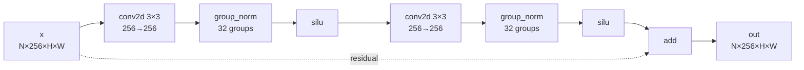
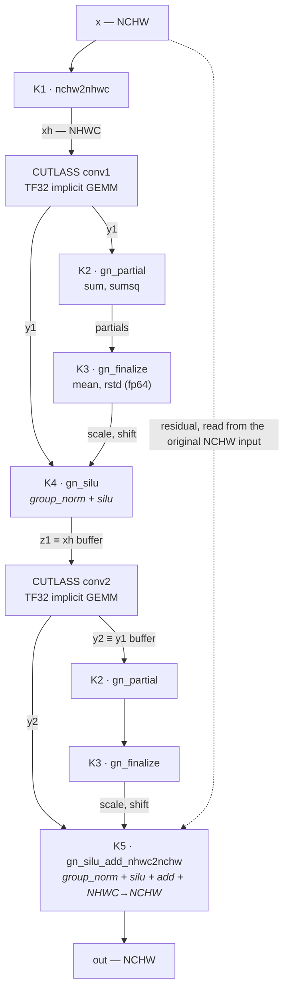
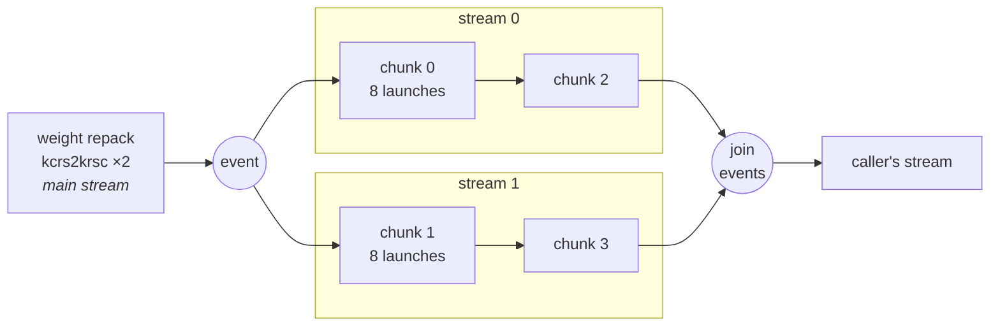

# What makes the best kernel faster

**Problem 002** — `vae_conv3x3_groupnorm_silu_residual_fused` · RTX 5090 · fp32 in/out, TF32 math

| | |
|---|---|
| **Kernel** | `kernel_20260806_070840.py` (`own_gemm` lineage, round 4) |
| **vs** | `torch.compile(mode="max-autotune")` — **1.238× geomean over 20 workloads, 20/20 wins** |

Every number below is an **ablation of this kernel against itself**: one copy of the winning kernel
with exactly one optimization switched off, measured over the same 20 workloads. Nothing is compared
against an older kernel or an earlier lineage round.

---

## Summary — the changes

Each figure is **how much slower the kernel gets when that one change is removed**. Geomean over 20
workloads, min-of-3 repeats, all variants passing 20/20.

### Independent levers — roughly multiplicative

| # | Change | Contribution | What it replaces |
|---|---|---:|---|
| **1** | [Own the convolution](#1-own-the-convolution-11161x) — CUTLASS TF32 implicit GEMM | **1.1161×** | `at::conv2d` / cuDNN |
| **2** | [Two-stream batch pipelining](#2-two-stream-batch-pipelining-10869x) | **1.0869×** | one serial stream |
| **3** | [Fused GN + SiLU + residual + transpose epilogue](#3-fused-epilogue-10420x) | **1.0420×** | 7 tensor passes → 3 |
| **4** | [Buffer aliasing by liveness](#4-buffer-aliasing-by-liveness-10201x) | **1.0201×** | 4 intermediates → 2 |
| **5** | [`float4` bounds-check-free tile path](#5-float4-full-tile-fast-path-10156x) | **1.0156×** | predicated scalar path |

```
                                      contribution to speed
                                      0%      5%      10%     15%
                                      |-------|-------|-------|
   Own the convolution (CUTLASS)     ###################        1.1161x
   Two-stream pipelining             ##############             1.0869x
   CTA tile 128x128x16               ::::::::::::::             1.0865x
   CTA-occupancy chunk gate          :::::::::::                1.0694x
   Fused GN+SiLU+add+transpose       #######                    1.0420x
   Buffer aliasing                   ###                        1.0201x
   float4 full-tile path             ##                         1.0156x

   #  independent lever      :  nested (already counted inside its parent)
   scale: 1.6 chars per 1%.  the +/-0.5% geomean noise floor is under 1 char
```

**`1.0869 × 1.1161 × 1.0420 = 1.264`**, slightly above the whole 1.238× margin over max-autotune —
so levers 1–3 account for essentially the entire win, and 4–5 are refinements.

### Nested levers — already counted inside their parent, do not multiply

| # | Change | Contribution | Nested inside |
|---|---|---:|---|
| **6** | [CTA/warp tile `128×128×16 / 64×64×16`](#6-cta-tile-geometry-10865x-nested-in-1) | 1.0865× | lever 1 |
| **7** | [CTA-occupancy chunk gate](#7-cta-occupancy-chunk-gate-10694x-nested-in-2) | 1.0694× | lever 2 |

### Not separably measurable

| # | Change | Status |
|---|---|---|
| **8** | [NHWC internal layout](#8-nhwc-internal-layout-not-measurable) | UNKNOWN — removing it means writing a different program |
| **9** | [Two-pass split-chunk GroupNorm reduction](#9-two-pass-groupnorm-reduction-not-measurable) | UNKNOWN — the only natural ablation is pathological |

---

---

# The computation graph

## What the problem specifies — 7 operations



PyTorch executes those 7 operations as **15 kernel launches**, 2374.7 µs on the mid shape:

| Kernel | Calls | µs | % |
|---|---:|---:|---:|
| `sm80_xmma_fprop_implicit_gemm_tf32f32…` — the convolutions | 2 | 1701.7 | **71.7%** |
| `cudnn::engines_precompiled::nchwToNhwcKernel` | 4 | 196.0 | 8.3% |
| `vectorized_elementwise_kernel` | 1 | 125.9 | 5.3% |
| `vectorized_elementwise_kernel` | 2 | 122.1 | 5.1% |
| `RowwiseMomentsCUDAKernel` | 2 | 119.4 | 5.0% |
| `elementwise_kernel` | 2 | 105.8 | 4.5% |
| `ComputeFusedParamsCUDA` | 2 | 3.7 | 0.2% |

> **This table is why lever 1 exists.** The convolution is **71.7%** of runtime, so leaving it to
> cuDNN caps the achievable speedup at **1 / 0.717 = 1.39×** by Amdahl's law — and only if every
> other kernel is driven to zero. The measured 1.238× against `max-autotune` is already 89% of that
> ceiling. Owning the convolution is the only way past it.
>
> Note also the **4** `nchwToNhwc` launches: cuDNN's fastest fprop engine is NHWC-internal, but the
> caller hands it NCHW, so both the activations and the filters are re-laid-out before every conv.

## What the kernel actually runs — 9 launches per chunk

Solid arrows are data dependencies; italics name the reference operations each kernel absorbs.



| | Reference | This kernel |
|---|---:|---:|
| Layout conversions | 4 | **1** (the return leg is fused into K5) |
| GroupNorm + SiLU + add kernels | 9 | **6** |
| Convolutions | 2 (cuDNN) | 2 (**owned**) |
| **Total launches** | **15** | **9 per chunk** |

`K5` is where the fusion pays: it reads conv2's NHWC output and, in one pass, applies the affine,
applies SiLU, adds the residual read straight from the original NCHW input, and writes NCHW — four
reference operations and a layout change in a single trip through memory.

## How chunks are scheduled across two streams



The event fence after the weight repack is required because both workers read the repacked weights.
The join re-synchronises onto the caller's stream so the kernel remains a drop-in replacement.
Chunk count comes from the [occupancy gate](#7-cta-occupancy-chunk-gate-10694x-nested-in-2) — the
mid shape gives `chunkN = 2`, 4 chunks; a batch-1 shape gives 1 chunk and the whole two-stream path
is skipped.

# The changes explained

## 1. Own the convolution (1.1161x)

**What changes.** Both 3×3 convolutions are executed by a CUTLASS implicit-GEMM convolution
instantiated inside the extension. There is no `at::conv2d` or cuDNN anywhere on the data path.

```c
cutlass::conv::kernel::DefaultConv2dFprop<
    float, TensorNHWC,  float, TensorNHWC,  float, TensorNHWC,  float,
    OpClassTensorOp, arch::Sm80,
    GemmShape<128,128,16>,   // threadblock tile
    GemmShape<64,64,16>,     // warp tile
    GemmShape<16,8,8>,       // m16n8k8 tensor-core MMA
    LinearCombination<float,4,float,float>,
    GemmIdentityThreadblockSwizzle<4>, 3,   // 3-stage pipeline
    OpMultiplyAdd, IteratorAlgorithm::kOptimized>
```

**Why it wins.** Not by better arithmetic — cuDNN dispatches CUTLASS kernels itself. It wins by
owning the layout contract and the epilogue outright. (The long-term-memory note that motivated this
lineage also claims cuDNN's TF32 path runs a separate `fp32→TF32 convertTensor` pre-pass worth
10–13%; no such kernel appears in this machine's reference profile, so treat it as the hypothesis
that prompted the attempt, not a measured cause here.) Owning the conv is also what makes levers 2, 3 and 8 possible at
all — you cannot fuse an epilogue into, or stream-schedule around, a call you do not own.

fp32 accumulators throughout, so the reference's numeric class is preserved.

**Where it pays.** Large shapes: `b32 128×128` 1.228×, `b4 256×256` 1.212×, `b2 256×192` 1.202×.
**Where it loses:** `b4 64×64` at **0.969×** — cuDNN is genuinely faster there. See
[remaining headroom](#where-the-remaining-headroom-is).

**Fairness of the comparison.** The `at::conv2d` path got the same `channels_last` buffers, a
pre-converted weight hoisted out of the chunk loop, the same TF32 numeric class, and its own
allocated output so no extra copy is charged to it. Re-run with `cudnn.benchmark = True` — cuDNN's
strongest configuration — it gives 1.1116×, so this is not an artifact of algorithm selection. The
one unaccounted confound runs *in cuDNN's favour*. Note the direction, though: measuring cuDNN at
its strongest *lowers* the lever, so **1.1161× is the default-cuDNN figure and 1.1116× is the value
against cuDNN's best configuration** — an upper and lower bracket, not a floor.

---

## 2. Two-stream batch pipelining (1.0869x)

**What changes.** GroupNorm moments are computed per `(image, group)`, so images are fully
independent. The batch is split into chunks, and each chunk's entire seven-stage chain runs on one
of two alternating pool streams, joined with CUDA events.

```c
static c10::cuda::CUDAStream worker[2] = {at::cuda::getStreamFromPool(),
                                          at::cuda::getStreamFromPool()};
...
c10::cuda::CUDAStream s = pipelined ? worker[k & 1] : main_stream;
c10::cuda::CUDAStreamGuard guard(s);
// chunk k: nchw2nhwc -> conv1 -> moments -> gn_silu -> conv2 -> moments -> gn_silu_add_nhwc2nchw
```

**Why it wins.** The profile is the whole argument, and it is measurable without any circularity.
Run the kernel with pipelining disabled (ablation A) and the forward is strictly serial at
**1761.6 µs**. The NCU table below puts the GroupNorm and transpose tail at 89.4 µs per chunk ×
4 chunks = **357.7 µs**, leaving **~1404 µs of convolution**. That is 154.6 GFLOP in 1404 µs =
**110 TFLOPS, 105% of the 104.8 TFLOPS nominal TF32 peak** — the conv is at the hardware limit, with
boost clocks carrying it just past the nominal figure.

Meanwhile the conv moves only 268 MB (two convs, read + write) in that time = **191 GB/s, 11% of the
1792 GB/s available**, and the tail kernels run at **70–86% of the DRAM roofline** (1.26–1.54 TB/s,
NCU table below).

So neither side can be made faster. Two complementary resources — tensor pipe and DRAM — are simply
being used one after the other. Overlapping chunk *k*'s convolution with chunk *k−1*'s memory-bound
tail removes **zero work** and recovers most of the 373 µs anyway.

This is the change `torch.compile` structurally cannot make: Inductor emits a single serial stream,
and `max-autotune`'s CUDA graphs remove *launch overhead* while faithfully preserving the
*serialization*.

```
   mid shape (b8 64x128), all figures measured, min-of-3    # busy   . idle
   1 char ~ 90 us

   BEFORE - one stream (ablation A)
     tensor  ###############....
     DRAM    ...............####
             |<- conv ~1404us ->|<- tail ->|
             110 TFLOPS = 105% of nominal    1.26-1.54 TB/s
             TF32 peak; DRAM 11% busy        = 70-86% of DRAM peak
             total 1761.6 us

   AFTER - two streams, chunk k's conv overlaps chunk k-1's tail
     tensor  ################
     DRAM    ################
             total 1479.1 us   19.1% faster (1.191x)
                               283 of the 358us tail hidden = 79%
```

No work is removed. Both resources are simply busy at the same time.

**Where it pays.** Many-image shapes: `b32 128×128` 1.223×, `b4 128×128` 1.196×, `b8 64×128` 1.191×.
It does nothing at batch 1 — there is nothing to chunk — and is faintly negative at `b1 1024×1024`
(0.974×).

**Cross-validated.** Ablation A (a one-line `pipelined = false` edit) and the **actual r0 seed
binary** compiled from its own source are two independent code paths that must measure the same
quantity. They agree to **0.15%** on the geomean (1.0869× vs 1.0853×), and within 1% per-workload on
16 of 20 — the exceptions are `b32 64×64` 4.4%, `b1 1024×1024` 3.6%, `b1 768×768` 2.1%,
`b4 256×256` 1.5%.

> The winner's parent in `optimization_tree.json` is the **r0 seed, not r1** — the winner is exactly
> *seed + `stream_pipeline_overlap`*, every CUDA kernel body byte-identical to the seed. The
> lineage's 4-shape metric bounds this at 1.2063 → 1.2684 = **1.0515×**; the true 20-workload value
> is **1.0869×**. The 4-shape proxy understated it by 3.5 points.

---

## 3. Fused epilogue (1.0420x)

**What changes.** `gn_silu_add_nhwc2nchw_kernel` reads the second convolution's NHWC output and, in
a single pass over memory, applies the GroupNorm affine, applies SiLU, adds the residual, and
transposes back to NCHW for the caller. Four reference operations and a layout change in one kernel.

```c
__shared__ float sm[TT][TT + 1];   // 64x65 padded tile — transposed staging, no bank conflicts
```

**Why it wins.** Pure traffic: **3 tensor passes instead of 7**. Inductor will not fuse across a
convolution — the conv is an extern/template call, so everything downstream of it starts a fresh
kernel and a fresh DRAM round trip. `max-autotune` fuses `group_norm → silu → add` into one Triton
kernel at best, and cannot fold the NHWC→NCHW transpose into that epilogue at all.

**Where it pays.** Scales cleanly with DRAM-boundness, and it is one of only two ablations positive on all
20 workloads (the other is the `float4` path, lever 5): `b1 1024×1024` 1.099×, `b16 64×64` 1.093×, `b1 768×768` 1.093×, `b4 256×256` 1.088×.
Small shapes ~1.01×.

---

## 4. Buffer aliasing by liveness (1.0201x)

**What changes.** Two intermediates instead of four, by writing over buffers whose contents are dead:

```c
// z1 == xh slice   (the staged NHWC copy of this chunk's x is dead by now)
// y2 == y1 slice   (conv1 output of this chunk is dead by now)
```

**Why it wins.** An L2 and footprint effect, not an allocator effect — the extra buffers in the
ablated version are allocated once per call, not per chunk. A smaller live working set per stream is
what keeps the overlapped DRAM traffic from colliding, so this interacts with lever 2.

**Where it pays.** Consistently on the largest working sets: `b16 64×64` 1.074×, `b32 128×128`
1.067×, `b1 768×768` 1.065×, `b1 1024×1024` 1.049×. Range 1.000 – 1.074×.

---

## 5. `float4` full-tile fast path (1.0156x)

**What changes.** Both shared-memory transposes carry a vectorized, bounds-check-free path taken
when the tile is full and `H·W` is divisible by 4:

```c
const int vec  = (HW % 4 == 0) ? 1 : 0;
const bool full = (vec != 0) && (p0 + TT <= HW);
```

**Why it wins.** Removes per-element predication and issues `float4` loads/stores in the interior,
falling back to the predicated path only on ragged edges.

**Where it pays.** `b16 64×64` 1.069×, `b1 768×768` 1.037×, `b64 64×64` 1.030×. Positive on all 20,
but this is **the smallest measured lever** — worth noting, because it is exactly the kind of change
that looks productive and is easy to over-invest in.

---

## 6. CTA tile geometry (1.0865x, nested in 1)

**What changes.** Halving the threadblock and warp tiles to `64×64×16 / 32×32×16`, changing nothing
else.

**Why it matters.** This is *why* the owned convolution wins — it is not a separate lever but the
substance of lever 1. A vendor call gives you no access to this knob at all.

**Where it pays.** The large compute-heavy shapes: `b32 128×128` 1.250×, `b4 256×256` 1.230×,
`b1 768×768` 1.219×. **Negative on small shapes** — `b4 64×64` 0.892×, `b1 128×128` 0.969×,
`b1 131×131` 0.979× — i.e. the small tile wins there. That is the same small-shape weakness lever 1
exposes, from the same cause.

---

## 7. CTA-occupancy chunk gate (1.0694x, nested in 2)

**What changes.** Removing the gate so every workload with `N ≥ 2` pipelines one image at a time.

```c
// CTAs for a chunk of c images: ceil(c*HW/128) M-tiles x ceil(C/128) N-tiles
for (int c = 1; c <= N; ++c) {
    long ctas = (((long)c * HW + 127) / 128) * tilesN;
    if (ctas >= 170) { chunkN = c; break; }      // 170 = SM count of the RTX 5090
}
const bool pipelined = (chunkN > 0 && chunks >= 2);
if (!pipelined) { chunkN = N; chunks = 1; }      // fewer than 2 chunks -> single stream
```

**Why it matters.** Chunking shrinks each convolution launch; too small and the conv stops filling
the GPU, losing more than the overlap gains. The gate picks the smallest chunk that still issues
≥ 1 CTA per SM, and declines to pipeline at all when two such chunks do not exist. **This is why
lever 2 never regresses** and why the kernel wins 20/20 rather than trading wins for losses.

**Where it pays.** Concentrated exactly where predicted — the `64×64` shapes, where the gate coarsens
the chunk to 3 images: `b64 64×64` 1.316×, `b16 64×64` 1.288×, `b32 64×64` 1.284×. It should be exactly 1.00× on the 13 shapes where the gate already picks `chunkN = 1`, and is on 9 of
them; `b1 768×768` (1.060), `b32 128×128` (1.055), `b1 1024×1024` (1.034) and `b4 256×256` (1.032)
move anyway — the clearest evidence that the per-shape noise floor is wider than ±2.6%.

---

## 8. NHWC internal layout (not measurable)

**What it is.** One `nchw2nhwc_kernel` stages `x` into NHWC on entry; the return transpose is folded
into the epilogue of lever 3, so it costs nothing extra. NHWC is an internal convention, never a
per-call conversion.

**Why it cannot be ablated.** The CUTLASS conv is instantiated NHWC-only and every GroupNorm and
epilogue kernel indexes NHWC throughout. Removing the layout means rewriting every kernel — a
different program, not an ablation.

**Consequence for the other numbers.** Ablation B **held NHWC constant** — the vendor conv was fed
`channels_last` input *and* weight and returned `channels_last`. So the 1.1161× credited to owning
the convolution is **net of** the layout choice, not inclusive of it.

---

## 9. Two-pass GroupNorm reduction (not measurable)

**What it is.** `gn_partial_kernel` computes per-`(n, g, chunk)` sums and sums-of-squares with
coalesced `float4` loads; `gn_finalize_kernel` collapses the partials into mean/rstd in double
precision. The partition is fixed and index-ordered with no atomics, so results are bit-reproducible
run to run.

**Why it was not measured.** Deliberately declined rather than faked. The natural ablation
(`numChunks = 1`) leaves a single 256-thread block serially reducing every pixel — 262 144 serial
iterations at 1024×1024 — which would measure a pathological configuration nobody would write. Any
smaller reduction in chunk count is an arbitrary alternative, not a control.

---

---

# Which lever carries which shape

Rows sorted by which lever dominates. Bar length is the slowdown when that lever is removed —
longer means that change matters more on that shape. 1 char ≈ 0.9%.

```
   workload            pipelining <--       --> owning the conv
   -----------------------------------------|---------------------------
   b2 128x128          PPPPPPPPPPPPPPPPPPPPP|CCCCCCCCC          1.188 / 1.082
   b64 64x64              PPPPPPPPPPPPPPPPPP|CCCCCCCCCCC        1.164 / 1.102
   b32 64x64              PPPPPPPPPPPPPPPPPP|CCCCCCCCCCC        1.162 / 1.102
   b16 64x64                 PPPPPPPPPPPPPPP|CCCCCCCCC          1.132 / 1.078
   b8 64x64                        PPPPPPPPP|CCCC               1.078 / 1.038
   b4 64x64                                 |                   1.003 / 0.969   <- cuDNN wins
   b4 128x128         PPPPPPPPPPPPPPPPPPPPPP|CCCCCCCCCCCCCCCCCCCC  1.196 / 1.178
   b8 64x128           PPPPPPPPPPPPPPPPPPPPP|CCCCCCCCCCCCCCCCCCCC  1.191 / 1.178
   b32 128x128     PPPPPPPPPPPPPPPPPPPPPPPPP|CCCCCCCCCCCCCCCCCCCCCCCCC 1.223 / 1.228
   b4 128x96                           PPPPP|CCCCCCC            1.044 / 1.066
   b4 96x128                           PPPPP|CCCCCCCC           1.046 / 1.072
   b2 256x192                PPPPPPPPPPPPPPP|CCCCCCCCCCCCCCCCCCCCCC 1.137 / 1.202
   b4 256x256                PPPPPPPPPPPPPPP|CCCCCCCCCCCCCCCCCCCCCCC 1.133 / 1.212
   b1 131x131                               |CCCCCCCCC          1.003 / 1.084
   b1 128x128                               |CCCCCCCCC          1.000 / 1.084
   b2 256x256                     PPPPPPPPPP|CCCCCCCCCCCCCCCCCCCCC 1.095 / 1.195
   b1 768x768                             PP|CCCCCCCCCCCCCC     1.022 / 1.130
   b2 64x64                                 |CCCCCCCCCCCCC      1.004 / 1.114
   b1 1024x1024                             |CCCCCCCCCCC        0.974 / 1.101
   b1 293x293                               |CCCCCCCCCCCCCCCC   1.000 / 1.144
   -----------------------------------------|---------------------------
   P = slowdown without pipelining     C = slowdown with cuDNN instead of CUTLASS
```

**Two regimes, and they barely overlap.**

- **Many-image shapes** (`b2`–`b64` at 64×64 / 128×128, except `b2 64×64` and `b4 64×64` where the
  gate declines to pipeline) are carried by **pipelining**. There are
  enough images to chunk, and the conv is short enough that hiding the tail matters most.
- **Large single-image shapes** (`b1 293×293`, `b1 768×768`, `b1 1024×1024`, `b2 256×256`,
  `b4 256×256`) are carried by **owning the conv**. Pipelining does nothing at batch 1 — there is
  nothing to split — and is faintly negative at `b1 1024×1024`.
- **`b4 64×64` is the one shape where neither helps**: pipelining is gated off and cuDNN is
  genuinely faster than the owned conv.

Only three shapes (`b4 128×128`, `b8 64×128`, `b32 128×128`) sit near the middle with both levers
contributing about equally.

---

# Resource utilization

Nsight Compute on the winning kernel, mid shape (`b8 64×128`), averaged over the profiled launches.
Durations are **per chunk** — the shape runs 4 chunks — so they are ~¼ of a whole-tensor pass.

| Kernel | Launches | Dur (µs) | SM % | **DRAM %** | L2 % | Occupancy % | Waves/SM | Bound by |
|---|---:|---:|---:|---:|---:|---:|---:|---|
| CUTLASS conv ×2 | 2/chunk | ~351 | **~105** | 11 | — | — | — | **tensor pipe** |
| `nchw2nhwc` | 6 | 14.1 | 12.1 | **83.9** | 41.6 | 68.7 | 1.20 | DRAM |
| `gn_partial` | 6 | 13.5 | 2.5 | **70.5** | 37.6 | 16.0 | 0.06 | DRAM |
| `gn_finalize` | 6 | 4.1 | 5.9 | 0.5 | 1.6 | 5.7 | 0.03 | **launch latency** |
| `gn_silu_nhwc` | 6 | 14.0 | 28.1 | **81.7** | 41.7 | 79.6 | 4.02 | DRAM |
| `gn_silu_add_nhwc2nchw` | 6 | 26.0 | 10.6 | **86.2** | 39.4 | 67.0 | 1.20 | DRAM |

The convolution row is **derived, not profiled** — the ncu and nsys runs filtered to the six custom
kernel names, so the CUTLASS kernel appears in neither. It is obtained by subtraction: ablation A
(pipelining off, therefore strictly serial) measures 1761.6 µs; the tail above sums to 89.4 µs per
chunk × 4 = 357.7 µs; the remainder is ~1404 µs of convolution, ~351 µs per chunk. That gives
154.6 GFLOP / 1404 µs = **110 TFLOPS = 105% of the 104.8 TFLOPS nominal TF32 peak**, and 268 MB /
1404 µs = **191 GB/s = 11% of the 1792 GB/s peak**.

```
                 SM / tensor pipe            DRAM
   conv          #####################(105%) ##(11%)
   gn_silu_add   ##(11%)                     #################(86%)
   nchw2nhwc     ##(12%)                     ################(84%)
   gn_silu       #####(28%)                  ################(82%)
   gn_partial    #(3%)                       ##############(71%)
   gn_finalize   #(6%)                       (0.5%)
```

**This table is the reason the kernel is shaped the way it is.** Every custom kernel except
`gn_finalize` sits at 70–86% of DRAM peak with SM throughput of 2.5–28%. The convolution is the
exact mirror: ~105% of nominal tensor-pipe peak, ~11% of DRAM. Neither side can be made faster on its own — they are each already
against a different wall — which is why the winning change was to run them **at the same time**
rather than to optimize either.

Two further readings:

- **`gn_finalize` is pure launch latency.** 0.5% DRAM, 5.7% occupancy, **0.03 waves per SM** — it
  computes 2 numbers per group and spends its life being launched. It is too small to fuse away
  without a grid-wide barrier, and too small to matter once overlapped.
- **`gn_partial` at 0.06 waves/SM is heavily under-occupied** for a kernel at 70% DRAM. That gap,
  plus `gn_finalize`, is the remaining device-side headroom — a single-pass cooperative GroupNorm
  would collapse both, and was drafted in an earlier lineage but never landed here.

# Method

Seven ablations, each built and measured separately, **3 repeats each**, one process at a time.
Per-workload **min-of-3** on both the ablation and the control; the control is the unmodified winner
rebuilt and re-measured in the same session.

Two things that would have silently corrupted this:

- **Extension cache collision.** Each ablated copy got its own `load_inline(name=...)` and its own
  `.so` — all eight present and distinct under `run/vae_block_002/prebuilt/`. Reusing the name serves
  the *unmodified* binary and
  produces clean-looking, meaningless results.
- **Drift normalization made things worse.** The stored trace's co-measured `reference_latency_ms`
  is noisier than the kernel latency itself — on `b16 64×64` the kernel reproduced to 0.2% while the
  normalized ratio moved 11.6%. In-session min-of-3 controls were used instead.

**Noise floor, measured not assumed.** The 6 workloads ablation A provably cannot affect give geomean
**1.0003×** (range 0.974 – 1.022). Treat any per-workload ratio inside **±2.6%** as noise on the levers ablation A can reach; a second
null control (ablation F on shapes the gate leaves untouched) excurses to +6.0%, so read single-shape
differences conservatively;
20-workload geomeans are good to about **±0.5%**.

**All seven ablations passed 20/20 workloads.** No number is quoted from a failed run.

---

# Where the remaining headroom is

Only **one** workload is faster with cuDNN by default. Two more flip only when cuDNN is given
`benchmark = True`:

| Workload | vs default cuDNN | vs cuDNN `benchmark=True` |
|---|---:|---:|
| b4 64×64 | **0.969×** | 0.932× |
| b1 128×128 | 1.084× | 0.991× |
| b1 131×131 | 1.084× | 0.995× |

The halved-tile ablation (lever 6) loses on exactly the same shapes, which says the `128×128×16` tile
is too coarse for small problems. A shape-dependent tile choice — or falling back to cuDNN below a
CTA threshold, mirroring what the occupancy gate already does for pipelining — is the obvious next
move.

---

# What did not help

- **Four lineage rounds followed round 4 and none was promoted.** Three regressed —
  `cta_tile_quantization_retune` 1.2590, `l2_resident_chunk_sizing` 1.2649, `atomic_privatize`
  1.2630, against round 4's 1.2684. A later round reached 1.2690 (`checkpoint.json`
  `last_score_for_curve`), 0.05% above round 4 and far inside the ±0.5% noise floor; the ratchet did
  not promote it, and `optimization_tree.json` still records round 4 as best.
- **Round 2 (`l2_persist_chunk_fusion`) failed to run at all.** Its successor deliberately chose a
  mechanism-distinct approach — concurrency rather than L2 residency — needing no
  `cudaStreamSetAttribute` or persisting-L2 machinery.
- **The `float4` fast path** is worth only 1.0156×, despite being the kind of change that looks
  productive.

---

# Sources

| | |
|---|---|
| Kernel | `run/20260805_132337_vae_block_002_lineages/own_gemm/…/code/kernel_20260806_070840.py` |
| Ablation sources | `run/vae_block_002/prebuilt/abl*.py` |
| Raw traces (3 repeats each) | `run/vae_block_002/out_abl_control{,_r2,_r3}/`, `out_abl_{A,B,B2,C,D,E,F,G,seed}_r{1,2,3}/` |
| Baseline | `run/vae_block_002/kernels/compile_maxautotune.py` |
| Full context | `REPORT_002_vae_resblock.md` |
